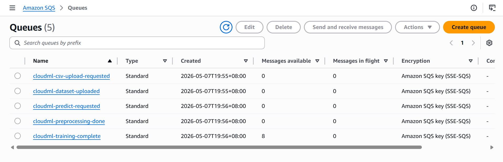
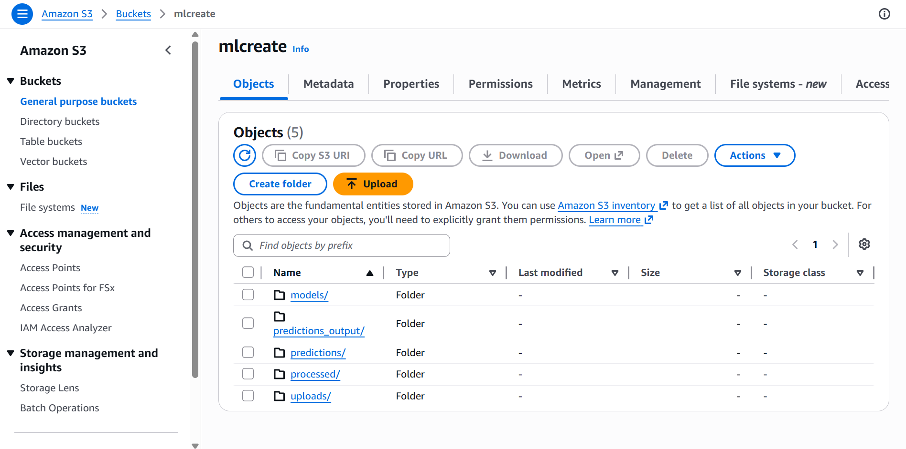
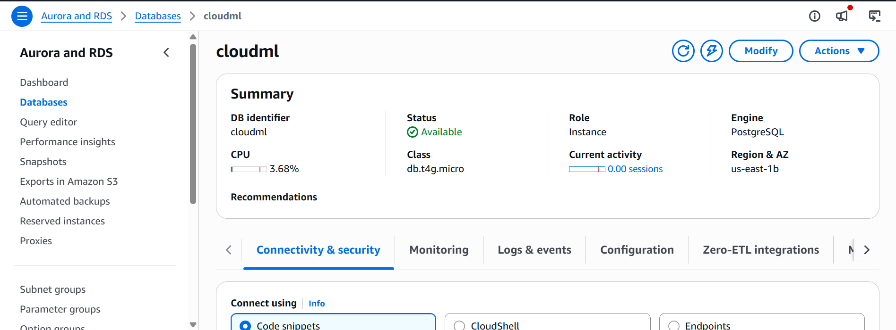
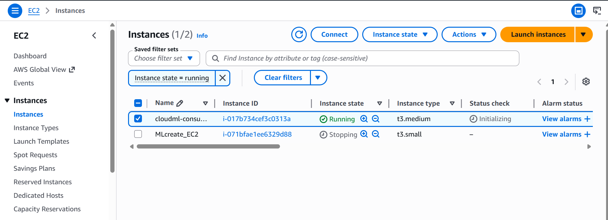
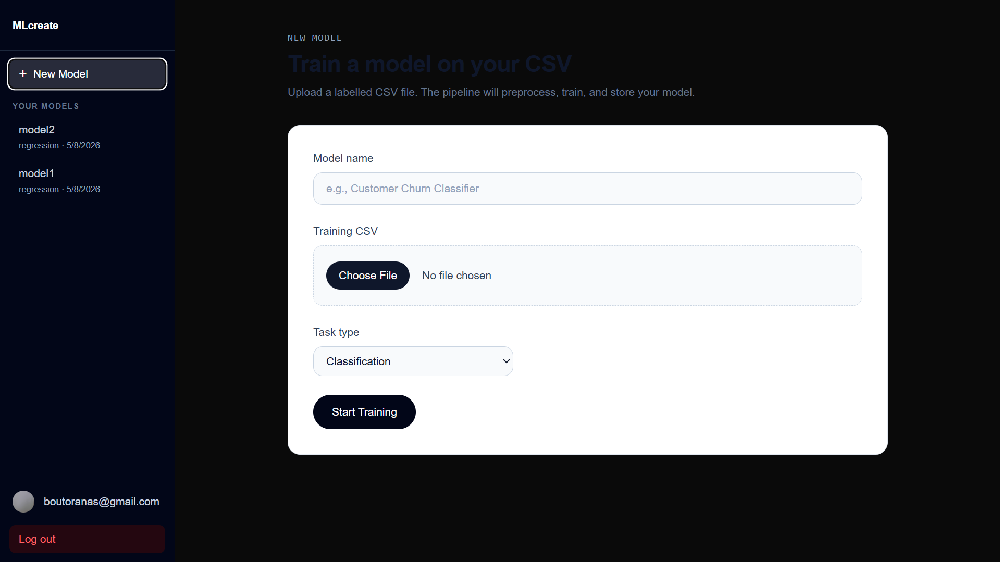
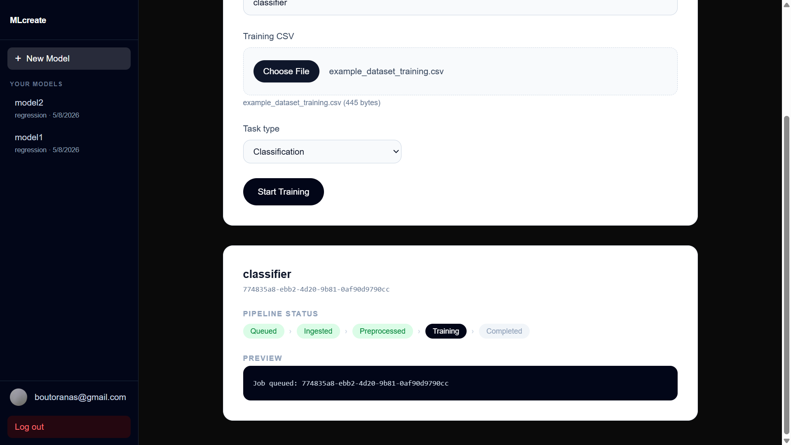
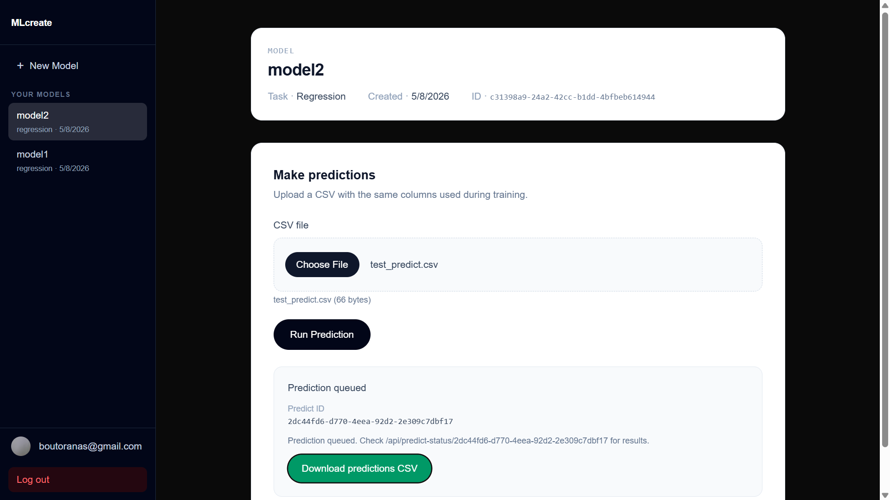

# MLcreate: A Cloud-Native Machine Learning Pipeline

**Author:** Anas Boutora — boutoranas@gmail.com

---

## 1. Introduction

MLcreate is a cloud-native, end-to-end machine learning platform that allows authenticated users to upload a labelled CSV dataset, automatically train a predictive model, and download inference results — all through a web interface with no local infrastructure required. The system was designed around AWS managed services and a microservice consumer architecture, with the goal of decoupling each stage of the ML pipeline so that it can scale and fail independently.

The platform supports both classification and regression tasks. Training attempts distributed execution via Apache Spark MLlib and XGBoost; if Spark is unavailable, it falls back gracefully through a chain of local learners. Predictions are returned as a downloadable CSV retrieved via a pre-signed S3 URL.

---

## 2. System Architecture

The pipeline is fully asynchronous. The Next.js frontend acts only as an entry point and status display; all heavy work runs on an EC2 instance as Docker containers that poll AWS SQS queues.

```
User Browser (Next.js + Clerk)
        │  HTTP upload + SQS trigger
        ▼
  cloudml-csv-upload-requested  ──▶  ingest_consumer
  cloudml-dataset-uploaded       ──▶  preprocess_consumer
  cloudml-preprocessing-done     ──▶  train_consumer
  cloudml-predict-requested      ──▶  predict_consumer
        │
        ▼
  Amazon S3  ◀──▶  EC2 Docker containers
  Amazon RDS (PostgreSQL)
```

Each consumer is a Python process running in a Docker container with `restart: unless-stopped`. The frontend infers job status from S3 artifact existence (`uploads/`, `processed/`, `models/*.meta`) and confirms completion from the PostgreSQL `models` table.

---

## 3. Technology Stack

### 3.1 Frontend

| Component | Technology |
|-----------|-----------|
| Framework | Next.js 16 (App Router), React 19 |
| Styling | Tailwind CSS v4 |
| Authentication | Clerk (email + Google OAuth) |
| Language | TypeScript |
| Deployment | Vercel |

Clerk provides managed auth including JWT verification on every API route via `auth()` from `@clerk/nextjs/server`. Users are isolated by `user_id` stored in the `jobs` table.


### 3.2 Message Queue — evolution from Kafka to SQS

The pipeline originally used **Apache Kafka** (`kafka-python 2.0.2`). Kafka required a Zookeeper + broker pair and manual topic creation (`scripts/create_kafka_topics.py`). While Kafka offered high throughput and log retention, operating it reliably on EC2 proved operationally heavy: the broker needed to be up before any consumer could start, topic creation was manual, and consumer group offsets had to be managed explicitly.

The project migrated entirely to **AWS SQS** (Standard queues). SQS is serverless, requires no broker management, and integrates natively with IAM. The five queues map directly to the pipeline stages. The ingest Dockerfile still carries the `kafka-python` installation from the original design, but the consumer code exclusively uses `sqs_utils.py` via `boto3`.



### 3.3 Object Storage — Amazon S3

All artefacts are stored in a single S3 bucket with a key-prefix layout:

```
uploads/<job_id>/<file>.csv       ← raw user upload
processed/<job_id>.parquet         ← normalised training data
models/<job_id>.pkl                ← sklearn/XGBoost model
models/<job_id>.pkl.spark/         ← Spark MLlib model directory
models/<job_id>.pkl.meta           ← training metadata JSON
predictions_output/<predict_id>.csv ← inference output
```

`s3_utils.py` wraps boto3 with helpers for single-file upload/download and recursive directory operations (needed for Spark model directories). Prediction results are served to the user via a pre-signed `GetObject` URL with a 1-hour expiry and a forced `Content-Disposition` download header.



### 3.4 Database — PostgreSQL on Amazon RDS

Job metadata and model records are stored in PostgreSQL. In production the database runs as an Amazon RDS `db.t4g.micro` instance (PostgreSQL engine). During local development the same schema is served by a `postgres:15-alpine` Docker container defined in `docker-compose.yml`.

Three tables are used: `jobs` (one row per upload, tracks `user_id`, `task_type`, `status`), `models` (one row per completed training run), and `metrics` (numeric evaluation results). The `train_consumer` writes to both `jobs` and `models` using `ON CONFLICT (job_id) DO NOTHING` to handle SQS at-least-once redelivery without crashing.

The Next.js layer connects via `pg` (node-postgres) using a `Pool` initialised from `DATABASE_URL`, with the SQLAlchemy dialect prefix (`postgresql+psycopg2://`) stripped before use.



### 3.5 Machine Learning — training stack with fallbacks

Training runs on a `t3.medium` EC2 instance. The `train_consumer` attempts four progressively simpler strategies:

1. **Spark XGBoost (distributed)** — PySpark 3.4.1 + `xgboost.spark.SparkXGBClassifier/Regressor`, 100 rounds, depth 6. Runs in local Spark mode (`local[*]`), reads the Parquet file, assembles a feature vector with `VectorAssembler`, performs an 80/20 random split, and writes the model directory to S3.
2. **Local XGBoost** — `xgboost 1.7.6` with `XGBClassifier(eval_metric='logloss')` or `XGBRegressor(objective="reg:squarederror")`, trained on a pandas DataFrame loaded from Parquet.
3. **scikit-learn LinearRegression** — used when XGBoost raises a runtime exception.
4. **MajorityClassifier / MeanRegressor** — zero-dependency pure-Python fallbacks that predict the majority class or mean target value respectively, ensuring the pipeline never crashes regardless of environment.

Evaluation metrics are computed manually (accuracy for classification; MSE, RMSE, R² for regression) and stored in the `metrics` table.

### 3.6 Infrastructure

| Resource | Configuration |
|----------|--------------|
| EC2 (consumers) | t3.medium, Amazon Linux 2023, Docker + Docker Compose |
| EC2 (earlier iteration) | t3.small — undersized for Spark, replaced |
| RDS | PostgreSQL 15, db.t4g.micro, us-east-1b |
| S3 | Standard bucket, us-east-1 |
| SQS | 5 Standard queues, SSE-SQS encryption |
| Vercel | Hobby tier, auto-deploy from main branch |



---

## 4. User Interface

The frontend provides three screens: a sign-in page (Clerk), a model creation page (CSV upload, task type selector, real-time pipeline status), and a model detail page (prediction upload + download).




On the model page, once a prediction job is queued the UI polls `/api/predict-status/<predict_id>` every five seconds. When the prediction CSV appears in S3, the route returns a pre-signed URL and a green "Download predictions CSV" button is rendered.



---

## 5. Challenges

**1. Kafka to SQS migration.** Kafka required a Zookeeper + broker pair running before any consumer could start. Topic creation was manual and consumer group offset management was error-prone. Replacing it with SQS eliminated the broker entirely; each consumer resolves the queue URL at startup and polls with long-polling (`WaitTimeSeconds=20`).

**2. EC2 git pull conflicts.** Docker containers run as root inside shared volumes. Files written by containers (Parquet datasets, trained model directories, SQS message JSON files) are owned by root and cannot be deleted by `ec2-user`. This blocked `git pull` repeatedly. The fix required `sudo rm -rf` for runtime directories and adding `messages/`, `processed/`, `models/`, `data/` to `.gitignore`.

**3. Docker build cache not being busted.** After pulling new code, `docker compose up --build` reused the cached Python layer and ran stale handler code. The `--build` flag only rebuilds if the Dockerfile or context has changed from Docker's perspective; it does not force a full rebuild. The solution was always using `docker compose build --no-cache <service>` before restarting a consumer.

**4. SQS at-least-once delivery causing duplicate DB inserts.** SQS guarantees at-least-once delivery; if a consumer crashes or takes too long, the message becomes visible again. The original `INSERT INTO models` with no conflict handling crashed with a primary key violation on the second delivery, leaving the job status stuck. The fix was `INSERT ... ON CONFLICT (job_id) DO NOTHING` wrapped in a try/except so DB failures print a warning instead of crashing the consumer.

**5. Job status incorrectly stuck on "training".** The job-status API inferred pipeline stage from S3 key presence. A logic inversion mapped the presence of `models/<id>.pkl.meta` (meaning training had *finished*) to the status `"training"` rather than `"completed"`. The bug was silent because the DB `models` insert was also failing (see challenge 4), so both the primary and fallback status checks agreed on the wrong answer.

---

## 6. Limitations

- **Credential rotation.** AWS Academy tokens expire per session. All five credential variables must be manually updated in both the EC2 `.env` file and Vercel environment settings. There is no automatic refresh mechanism.
- **No horizontal scaling.** A single EC2 instance runs all four consumers sequentially within their Docker containers. Concurrent training jobs queue up and are processed one at a time.
- **Spark in local mode only.** The Spark session runs `local[*]`, which uses all cores on the single EC2 node. True distributed execution (across a Spark cluster or EMR) is not configured. For small CSV uploads the JVM startup overhead of Spark (~30 s) exceeds the actual training time.
- **No model versioning.** Retraining a job overwrites the S3 key for that `job_id`. There is no mechanism to compare model versions or roll back.
- **Batch predictions only.** Inference is a one-shot batch job triggered manually. There is no real-time prediction endpoint (REST or otherwise).
- **No input validation on prediction CSVs.** If the user uploads a prediction CSV with different columns from training, the handler fails silently with a generic error.

---

## 7. References

1. Amazon Web Services. *Amazon SQS Developer Guide*. https://docs.aws.amazon.com/AWSSimpleQueueService/latest/SQSDeveloperGuide/
2. Apache Software Foundation. *PySpark 3.4.1 Documentation*. https://spark.apache.org/docs/3.4.1/api/python/
3. Chen, T. & Guestrin, C. (2016). XGBoost: A Scalable Tree Boosting System. *KDD '16*. https://doi.org/10.1145/2939672.2939785
4. Clerk Inc. *Clerk Next.js SDK Documentation*. https://clerk.com/docs/nextjs/overview
5. Vercel Inc. *Next.js 16 App Router Documentation*. https://nextjs.org/docs/app
6. Amazon Web Services. *Amazon S3 Pre-signed URLs*. https://docs.aws.amazon.com/AmazonS3/latest/userguide/ShareObjectPreSignedURL.html
